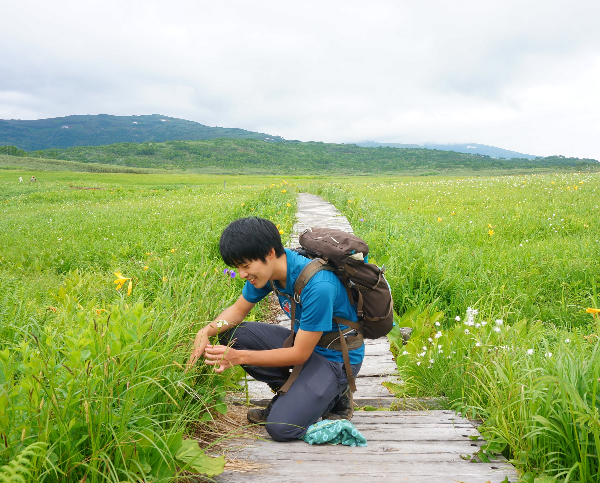

<!-- ```{r setup, include=FALSE} -->

<!-- rm(list=ls())  # reset workspace -->
<!-- options(scipen=100)  # do not show numbers using exponential -->

<!-- # install & load packages -->
<!-- pacman::p_load( -->
<!--   openxlsx   # open excel -->
<!--   , tidyverse -->
<!--   , magrittr   # extended pipe -->
<!--   , knitr   -->
<!--   , kableExtra # nice tables -->
<!--   , pander     # nice tables -->
<!-- ) -->

<!-- # Rmarkdown settings -->
<!-- knitr::opts_chunk$set( -->
<!--   prompt  = FALSE,  # Do not add > or + in inline-code -->
<!--   message = FALSE,  -->
<!--   comment = "",  -->
<!--   warning = FALSE,  # Mute warnings -->
<!--   tidy    = TRUE, -->
<!--   echo = FALSE -->
<!--   )  -->
<!-- options(knitr.kable.NA = '') # Hide NAs in kable table -->

<!-- ``` -->

<div style="margin-bottom:30px;">
</div>

米国テキサスA&M大学、[Gil G. Rosenthal研究室](https://swordtail.tamu.edu/)の博士研究員です。

Email: k.atsumi115_at_gmail.com

<div style="margin-bottom:30px;">
</div>



<div style="margin-bottom:60px;">
</div>

# 履歴

<div style="margin-bottom:30px;">
</div>

### 学歴

|  |  |  |
| --- | -- | ----- |
| 2016.4 - 2020.3 | 博士 | 北海道大学大学院 環境科学院 生物圏科学専攻 <br> 指導教官、[小泉逸郎博士](https://noah.ees.hokudai.ac.jp/envmi/koizumilab/) |
| 2014.4 - 2016.3 | 修士 | 東京大学大学院 農学生命科学研究科 水圏生物科学専攻 |
| 2010.4 - 2014.3 | 学士 | 北海道大学 水産学部 海洋生物科学科 |
| 2007.4 - 2010.3 | | 名古屋市立 菊里高等学校 普通科 |

1992年、名古屋市生まれ。

<div style="margin-bottom:30px;">
</div>

### 職歴ほか

| | |
| -- | ------ |
| 2021.3 - | 米国・テキサスA&M大学（[Gil Rosenthal研究室](https://swordtail.tamu.edu/)）に<br>日本学術振興会 海外特別研究員として滞在 |
| 2017.10-12、2019.10-12 | 豪州・ニューサウスウェールズ大学<br>（[Shinichi Nakagawa研究室](http://www.i-deel.org/)）に留学 |
| 2018.4 - 2020.3 | 日本学術振興会 博士課程特別研究員DC2 |
| 2016.5 - 2017.2 | 北海道大学 リサーチアシスタント |
| 2016.5 - 2017.2 | 北海道大学 ティーチングアシスタント |
| 2015 - 2016 | 国立科学博物館 研究補助（魚類標本管理） |
| 2013 - 2014 | 北海道大学総合博物館ボランティア（魚類標本作成･管理･展示） |

<div style="margin-bottom:60px;">
</div>

# 実績

<div style="margin-bottom:30px;">
</div>

### 掲載済み論文

<a href="https://scholar.google.com/citations?user=PMk-FAx8vzAC&hl=ja"> </a>
<a href="https://www.researchgate.net/profile/Keisuke-Atsumi"> </a>

論文リストは[Google scholar](https://www.researchgate.net/profile/Keisuke-Atsumi)にて。

[Researchgate](https://www.researchgate.net/profile/Keisuke-Atsumi)でPDF手に入ります。

- 査読あり、筆頭著者での英語論文：8編  

- 査読あり、筆頭著者での和文総説：1編（日本生態学会誌での特集号を企画）  

- 査読あり、共著での英語論文：1編  

- 査読あり、共著での和文論文：1編  

- 査読なし、共著での和文論文：1編  

<!-- ```{r} -->

<!-- read.xlsx( -->
<!--   "業績.xlsx", sheet = "論文" -->
<!--   ) %>% -->
<!--   filter(Peer.reviewed == "Y") %>% -->
<!--   arrange(desc(Year, Month)) %>% -->
<!--   mutate(No = row_number()) %>% -->
<!--   select_("No", "著者", "題目", "雑誌", "要約", "DOI") %>% -->
<!--   kable("html") %>%  -->
<!--   kable_styling("striped", position = "left") %>%  -->
<!--   scroll_box(width = "170%", height = "500px") -->

<!-- ``` -->

<div style="margin-bottom:30px;">
</div>

### 未掲載論文

- *Atsumi K*, Ross SRPJ, Kishida O. Interpopulation differences in developmental plasticity of carnivores determine the emergence of a trophic interaction. *submitted*    

- *Atsumi K*, Lagisz M Nakagawa S. Non-additive genetic effects induce novel phenotypic distributions in male mating traits of F1 hybrids. *Evolution - accepted*   

いずれも*EcoEvoRxiv*にプレプリントとして公開しております。

<div style="margin-bottom:30px;">
</div>

### 集会企画

| | |
| - | --------- |
| 2016-2020 | **EZOゼミ** - 北海道大学の生態・進化生物学者のための分野横断型セミナーシリーズ |
| 2018.3 | 日本生態学会大会での自由集会　**動物の個性の理解とその生態学的可能性を求めて**。本集会の内容は日本生態学会誌の同名の特集として出版されました |


<div style="margin-bottom:30px;">
</div>

### 一般向け解説

| | | |
| ----- | --- | -- |
| 題目 | 掲載元 | 発行・実施年 |
| 釣り人の写真は貴重な資料！Web上の写真をもとに川魚ウグイの繁殖生態を明らかにする | [academist journal](https://academist-cf.com/journal/?p=4492)<br>(academist) | 2017 |
| ウグイ類のメスが派手な理由とは：魚たちのお見合い実験奮闘記 | [BuNa](https://buna.info/article/2242/)（文一総合出版) | 2019 |
| 寄生虫を使ってウグイの育ちを調べる | 西岡公園<br>札幌市カルチャーナイト | 2018 |

<div style="margin-bottom:30px;">
</div>

### 研究資金獲得

| | |
| -- | ------ |
| 2020.4 - 2022.3 | 日本学術振興会 海外特別研究員 |
| 2018.4 - 2020.3 | 日本学術振興会 特別研究員DC2 |
| 2017.4 - 2018.3 | 藤原ナチュラルヒストリー振興財団 |
| 2017.4 - 2018.3 | 日本学術協会 笹川科学研究助成 |

<div style="margin-bottom:30px;">
</div>

### 受賞

| | |
| -- | ------- |
| 2019.3 | 日本生態学会 最優秀ポスター賞（共著） |
| 2018.3 | 北海道大学環境科学院 ポスター発表セッション 優秀研究賞（主著） |
| 2018.3 | 生態学国際誌*Ecological research*の[論文賞](https://link.springer.com/article/10.1007/s11284-017-1466-z)（主著） |
| 2017.12 | 日本生態学会北海道地区会　優秀研究賞（共著） |
| 2016.6 | JASSO 奨学金返済半額免除（修士課程） |
| 2015.6 | 北海道大学 新渡戸賞 受賞（学部１年次の成績上位５%に授与） |

<div style="margin-bottom:60px;">
</div>

# 研究関連技術

<div style="margin-bottom:30px;">
</div>

### Computer (*Software*)

- *R*を使った統計解析 (e.g. 系統メタ解析・ベイズモデル)

- ゲノム解析 (*plink*使用)

- 作画・編集 (*inkscape*、*gimp*、*sai*使用)

<div style="margin-bottom:30px;">
</div>

### 野外調査

- 電気ショッカー・投網などによる魚の捕獲  

- 大規模わな等を使った両生類の捕獲

- バイオロギングによる魚の行動追跡

<div style="margin-bottom:30px;">
</div>

### 実験

- 行動実験｜個性計測とお見合い実験

- 飼育実験｜屋内・野外での、両生類を使ったメソコズム実験

- DNA実験｜プライマー設計、マイクロサテライト（STR）分析、RFLP分析、サンガーシーケンス

- 標本解剖｜魚の筋肉・骨格・神経系の観察、寄生虫の感染チェック

<div style="margin-bottom:30px;">
</div>

### 資格

- 普通運転免許（2011.7）

- ダイビングライセンス・アドバンスダイバー（2014.1）

- 潜水士免許（2014.7）
